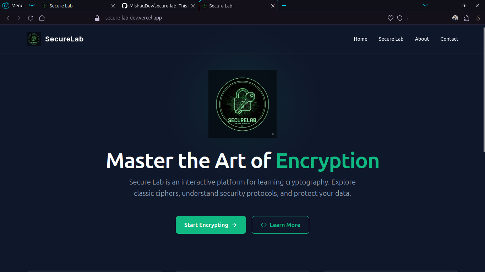
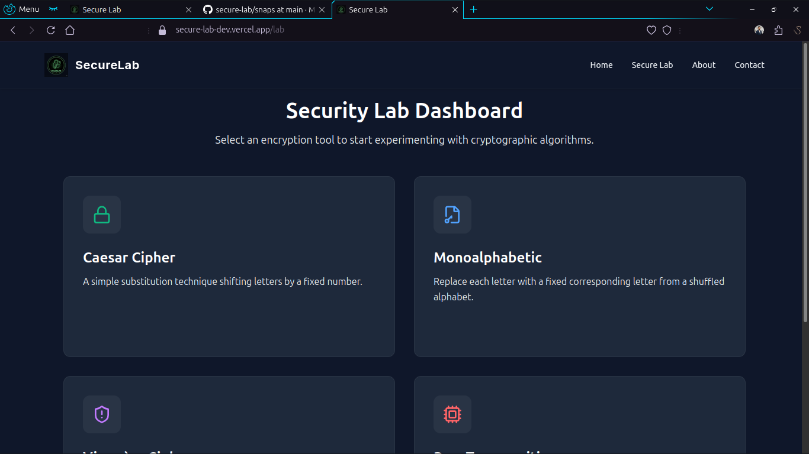

# 🔐 SecureLab

SecureLab is a web-based cryptography lab that allows users to **encode and decode messages** using classical encryption algorithms.  
This project is built for learning and demonstrating how traditional cipher techniques work in practice.

---

## 🚀 Features

- Encode and decode text messages
- Interactive and user-friendly web interface
- Supports multiple classical cipher algorithms
- Input validation and dynamic key handling

---

## 🔑 Cipher Algorithms Implemented

### 1. Caesar Cipher
A substitution cipher where each letter in the plaintext is shifted by a fixed number of positions in the alphabet.

### 2. Monoalphabetic Cipher
A substitution cipher that uses a fixed permutation of the alphabet for encryption and decryption.

### 3. Vigenère Cipher
A polyalphabetic substitution cipher that uses a keyword to determine shifting values for each character.

### 4. Row Transposition Cipher
A transposition cipher that rearranges the plaintext characters into rows based on a key and reads them column-wise.

---

## 🖼️ UI Screenshots\





---

## 🛠️ Tech Stack

- **Frontend:**    
- **Styling:** 
- **Logic:**   
- **Tooling:**   

---
## ⚙️ Installation & Setup

1. Clone the repository
```bash
git clone https://github.com/MIshaqDev/secureLab/.git
cd secureLab
```
2. Install dependencies
```bash
npm install
```

3. You have to make .env file in both backend and frontend. In backend you have to add Frontend link and in frontend you have to add backend link.

4. Run backend
```bash
cd backend
npm run dev
```

5. Run frontend
```bash
cd Secure-Lab
npm run dev
```
---
## 👨‍💻 Author

**Muhammad Ishaq**  
BS Computer Science Student  

[](https://github.com/MIshaqDev)
[](mailto:muhammadishaq.dev@gmail.com)

